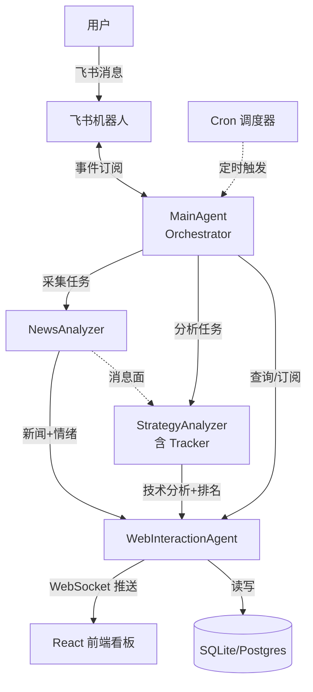

# 智投研 — 基于 Hermes Agent 的自我进化股票量化 Agent 集群

## 项目概览
本项目构建一个**自我进化的股票量化 Agent 集群**,主要覆盖 **A 股**与 **H 股**,以**美股、期货等外围市场**作为消息面与情绪面的辅助依据。
用户通过**飞书机器人**与一个**主 Agent (Orchestrator)** 对话,由主 Agent 调度新闻分析、策略分析与 Web 交互三类子 Agent 协同完成情报采集、技术分析、跟踪更新与可视化推送。

**目标**:
- 人机协作:用户在飞书与主 Agent 自然语言对话,触发分析任务、查询关注列表、订阅板块/个股。
- 信息聚合:全自动采集新闻 -> 情绪/影响评估 -> 技术面交叉验证 -> 推送到 Web 看板。
- 自我进化(Phase 2):基于历史报告反馈与 RL 流水线持续优化策略与排名。

## 技术栈

### Phase 1 (核心,当前重点)
- **Agent 框架**: Hermes Agent (Nous Research) — Python SDK,v3.x,通过 [Profiles](https://hermesagent.org.cn/docs/user-guide/profiles) 启动多 Agent 实例
- **语言**: Python 3.11+
- **数据接口**:
  - A 股 / H 股行情:AKShare、Tushare Pro
  - 新闻 / 财报:东方财富、同花顺 iFinD (可选)、AKShare
  - 外围消息面:美股 / 期货 (AKShare、Yahoo Finance)
  - 指标计算:TA-Lib、pandas-ta、NumPy、Pandas
- **网关**: 飞书自定义机器人 + 飞书事件订阅 (WebSocket 长连接)
- **Web 端**:
  - 后端:FastAPI + Uvicorn + SQLAlchemy
  - 前端:React 18 + TypeScript + Ant Design + ECharts
  - 数据库:SQLite (开发) / PostgreSQL (生产)
  - 实时通信:WebSocket (Agent 主动推送热榜与告警)
- **定时任务**: Hermes 内置 Cron + APScheduler (本地兜底)
- **报告格式**: Markdown (含表格、Mermaid 图、ECharts 图片链接)

### Phase 2 (后续阶段,待 Phase 1 稳定后启动)
- **回测引擎**: SimTradeLab (PTrade API 本地仿真)
- **RL 训练**: Hermes 内置 Tinker-Atropos 流水线 (GRPO + LoRA)

## "gstack"
Use the /browse skill from gstack for all web browsing, never use mcp__claude-in-chrome__* tools.
Available skills: /office-hours, /plan-ceo-review, /plan-eng-review, /plan-design-review, /design-consultation, /design-shotgun, /design-html, /review, /ship, /land-and-deploy, /canary, /benchmark, /browse, /connect-chrome, /qa, /qa-only, /design-review, /setup-browser-cookies, /setup-deploy, /setup-gbrain, /retro, /investigate, /document-release, /codex, /cso, /autoplan, /plan-devex-review, /devex-review, /careful, /freeze, /guard, /unfreeze, /gstack-upgrade, /learn.

## 核心 Agent 集群 (共 4 个)

| Agent | 职责 | 触发方式 | 主要输出 |
|---|---|---|---|
| **MainAgent (Orchestrator)** | 飞书对话入口、自然语言意图解析、任务编排、关注列表与定时调度管理 | 飞书消息 + Cron | 飞书回复 / 子 Agent 任务派发 |
| **NewsAnalyzer** (合并 NewsCollector + Impact + Sentiment) | 多源新闻搜集、板块/个股关联、情绪打分、影响评估 | MainAgent 调度 / 定时 | `news_digest_{date}.json`、`impact_report.md` |
| **StrategyAnalyzer** (含 Tracker 职能) | 大盘指数 / 行业 ETF / 板块 / 个股的 11 种策略技术面分析 + 定时跟踪增量更新 | MainAgent 调度 / 定时 (1-2 天周期) | `market_tech_{code}.md`、`stock_score_{code}.md` |
| **WebInteractionAgent** | 聚合各 Agent 输出、写入数据库、通过 WebSocket 主动推送 Web 前端更新 | 监听其他 Agent 事件 | 数据库写入 + WebSocket 推送 |

## 核心功能矩阵

| 编号 | 功能 | 主责 Agent | 协作 |
|---|---|---|---|
| F1 | 飞书自然语言对话 (查询、订阅、命令) | MainAgent | 全部 |
| F2 | 新闻搜集 + 板块/个股影响 + 情绪分析 | NewsAnalyzer | MainAgent |
| F3 | 大盘指数 / 行业 ETF / 板块 11 策略技术面分析 | StrategyAnalyzer | NewsAnalyzer |
| F4 | 个股 11 策略技术面分析 + 系统性打分 | StrategyAnalyzer | NewsAnalyzer |
| F5 | 板块/个股定时跟踪与增量更新 (1-2 天) | StrategyAnalyzer | NewsAnalyzer |
| F6 | Web 看板 (热榜、关注列表、标签、历史新闻库) | WebInteractionAgent | 全部 |
| F7 | Agent 主动推送股票/板块到 Web 并更新排名 | WebInteractionAgent | StrategyAnalyzer |

## 多 Agent 协作架构



## Web 前端核心特性 (Phase 1 主要开发任务)

### 看板模块
- **热榜**: 实时显示 Top 板块 / 个股 (按情绪 + 技术得分综合排名)
- **关注列表**: 用户在飞书添加的板块/个股,Web 端同步显示并支持标签管理
- **历史新闻库**: 全文检索、按板块/个股/时间筛选、情绪标签过滤
- **个股/板块详情页**: 11 策略技术分析图表 (ECharts)、关联新闻流、跟踪报告时间线

### Agent <-> Web 自动化数据流
- **4.1 自动同步**: StrategyAnalyzer / NewsAnalyzer 在分析中识别到新股票或板块时,通过 WebInteractionAgent **主动推送**到数据库并广播 WebSocket 事件,前端实时增量更新关注池。
- **4.2 排名自动更新**: WebInteractionAgent 根据用户反馈 (点击、收藏、显式打分) + 最新分析结果,周期性重算板块/个股排名,通过 WebSocket 推送到前端。

## 项目结构 (建议)

```
agent-stock/
├── agents/                     # Hermes Agent 实例
│   ├── main_agent/            # MainAgent + 飞书事件订阅
│   ├── news_analyzer/         # 新闻+情绪+影响
│   ├── strategy_analyzer/     # 11 策略 + Tracker
│   └── web_interaction/       # Web 推送 Agent
├── strategies/                 # 11 种技术分析策略 (Skill 形式)
├── data/                       # AKShare/Tushare 数据访问层
├── web/
│   ├── backend/               # FastAPI
│   └── frontend/              # React + Ant Design
├── lark/                       # 飞书机器人 + 事件订阅
├── reports/                    # Agent 输出的 Markdown 报告
├── profiles/                   # Hermes Profile 配置 (启动多 Agent)
└── CLAUDE.md
```

## Phase 2 路线图 (暂不实现)
- **回测引擎**: 接入 SimTradeLab,把 11 策略转为 PTrade 兼容代码,基于历史报告与新闻做策略验证
- **RL 自优化**: 用 Hermes Tinker-Atropos 流水线 (GRPO + LoRA),以回测收益为奖励信号,持续微调策略权重与排名模型
- **触发条件**: Phase 1 至少 4 周稳定运行 + 历史新闻库与跟踪报告积累足够样本
